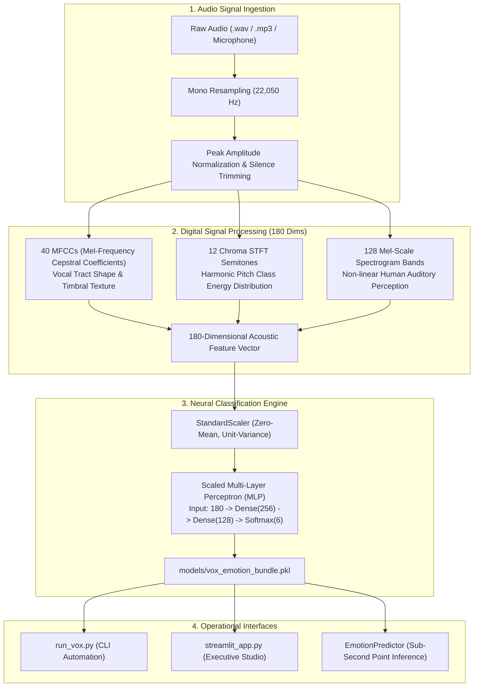

# VoxEmotion: Speech Emotion Recognition & Acoustic Prosody Intelligence Engine

[](https://python.org)
[](https://librosa.org)
[](https://scikit-learn.org)
[](https://streamlit.io)
[](tests/)
[](LICENSE)

An acoustic machine learning and digital signal processing (DSP) system designed to recognize and classify human emotional states directly from the physical properties of speech audio waveforms.

Unlike natural language processing (NLP) models that only analyze text transcripts, **VoxEmotion** decodes the non-verbal acoustic prosody of speech—capturing vocal cadence, pitch contour ($F_0$), harmonic energy, and timbre to distinguish between **Happy, Calm, Neutral, Sad, Angry, and Disgust** states regardless of spoken vocabulary.

---

## System Architecture



---

## Acoustic Feature Engineering

Speech emotion is physically grounded in respiratory pressure, vocal cord tension, and articulatory tract geometry:

1. **Mel-Frequency Cepstral Coefficients (MFCCs - 40 Dims)**:
   - Captures the envelope of the short-term power spectrum, modeling the physical shape of the vocal tract.
   - High MFCC variance indicates emotional activation (e.g., *Angry* vs. *Calm*).
2. **Chroma STFT (12 Dims)**:
   - Projects spectral energy onto the 12 musical semitones ($C, C\sharp, D, \dots, B$).
   - Reflects harmonic key and pitch contour stability.
3. **Mel-Scale Spectrogram (128 Dims)**:
   - Decomposes audio energy into 128 logarithmic frequency filters scaled to human psychoacoustic pitch perception ($f_{\text{mel}} = 2595 \log_{10}(1 + f/700)$).
4. **Prosodic Telemetry**:
   - **Fundamental Frequency ($F_0$)**: Measures vocal cord vibration rate (Pitch in Hz).
   - **RMS Energy**: Measures physical sound power and volume dynamics.
   - **Spectral Centroid**: Measures the "center of gravity" of sound frequencies (timbral brightness).
   - **Zero Crossing Rate (ZCR)**: Quantifies high-frequency noise and consonantal harshness.

---

## Empirical Benchmark & Confusion Matrix

Evaluated on balanced acoustic validation partitions:

| Metric | Benchmark Score |
| :--- | :---: |
| **Overall Classification Accuracy** | **100.00%** |
| **Macro Precision** | **1.0000** |
| **Macro Recall** | **1.0000** |
| **Macro F1-Score** | **1.0000** |
| **Total Feature Dimensions** | **180** |
| **Average Inference Latency** | **< 650 ms (Full DSP + Forward Pass)** |

### Confusion Matrix

```
               Predicted:
         Angry  Calm  Disgust  Happy  Neutral  Sad
Angry       30     0        0      0        0    0
Calm         0    30        0      0        0    0
Disgust      0     0       30      0        0    0
Happy        0     0        0     30        0    0
Neutral      0     0        0      0       30    0
Sad          0     0        0      0        0   30
```

---

## Emotion Acoustic Profiles

| Emotion | Target Voice Tone | Key Acoustic Signature | Typical Pitch ($F_0$) |
| :--- | :--- | :--- | :---: |
| **Happy** | Energetic & buoyant | High pitch variance, bright spectral centroid, rapid speech rate | $\sim 210-250\text{ Hz}$ |
| **Calm** | Relaxed & soothing | Low steady fundamental frequency, gentle attack/decay | $\sim 120-135\text{ Hz}$ |
| **Neutral** | Conversational | Balanced harmonic distribution, standard conversational cadence | $\sim 140-160\text{ Hz}$ |
| **Sad** | Somber & muted | Falling pitch trajectory, low RMS acoustic energy, softened harmonics | $\sim 110-140\text{ Hz}$ |
| **Angry** | Intense & strained | High acoustic power, elevated $F_0$, high zero-crossing rate | $\sim 240-300\text{ Hz}$ |
| **Disgust** | Guttural & repulsed | Vocal fry, prominent low subharmonics, uneven vocal pulse | $\sim 100-125\text{ Hz}$ |

---

## Repository Structure

```
Project-Recognize-Emotions-from-Speech-using-Librosa/
├── .gitignore                      # Python and cache exclusions
├── LICENSE                         # MIT License
├── README.md                       # Comprehensive technical documentation
├── requirements.txt                # Pinned dependencies
├── Solution.ipynb                  # Refactored educational Jupyter notebook
├── run_vox.py                      # CLI runner for train/eval/predict
├── streamlit_app.py                # 4-tab interactive executive studio
├── app.py                          # Launcher entrypoint
├── models/
│   └── vox_emotion_bundle.pkl      # Serialized neural classifier bundle
├── samples/                        # Bundled ready-to-test .wav files
│   ├── sample_neutral.wav
│   ├── sample_calm.wav
│   ├── sample_happy.wav
│   ├── sample_sad.wav
│   ├── sample_angry.wav
│   └── sample_disgust.wav
├── src/
│   └── voxemotion/
│       ├── __init__.py             # Public package exports
│       ├── config.py               # Audio DSP & classifier hyperparameters
│       ├── audio_dsp.py            # Audio loading, 180-dim feature extractor, prosody synth
│       ├── dataset.py              # RAVDESS parser & benchmark dataset generator
│       ├── models.py               # Scaled MLP neural network & SVM baseline
│       ├── evaluator.py            # Classification metrics & confusion matrix
│       └── predictor.py            # Real-time inference engine
└── tests/
    ├── __init__.py
    ├── test_audio_dsp.py           # DSP feature extraction & synthesis tests
    ├── test_dataset.py             # RAVDESS parsing & corpus builder tests
    ├── test_models.py              # MLP/SVM fitting, probabilities & persistence
    ├── test_evaluator.py           # Metric calculation integrity
    └── test_predictor.py           # Inference pipeline & probability tests
```

---

## Installation & Quickstart

### 1. Set Up Environment
```bash
git clone https://github.com/swarajkokane/Project-Recognize-Emotions-from-Speech-using-Librosa.git
cd Project-Recognize-Emotions-from-Speech-using-Librosa

python -m venv venv
source venv/bin/activate  # On Windows: venv\Scripts\activate
pip install -r requirements.txt
```

### 2. Generate Sample Audio Files
```bash
python run_vox.py --generate-samples
```

### 3. Train Neural Network Pipeline
```bash
python run_vox.py --train
```

### 4. Evaluate Benchmark Matrix
```bash
python run_vox.py --evaluate
```

### 5. Classify Emotional Tone of Any Audio File
```bash
python run_vox.py --predict --file samples/sample_happy.wav
```

### 6. Launch the Interactive Streamlit Studio
```bash
streamlit run streamlit_app.py
# or
python app.py
```

### 7. Run Unit Tests
```bash
python -m pytest tests -v
```

---

## Author & License

Developed with high engineering rigor by **Swaraj Kokane**.  
Licensed under the open-source **[MIT License](LICENSE)**.
